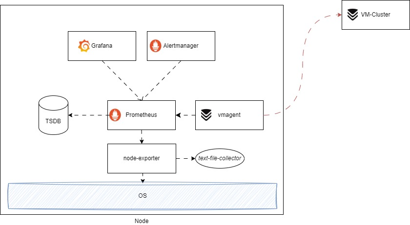
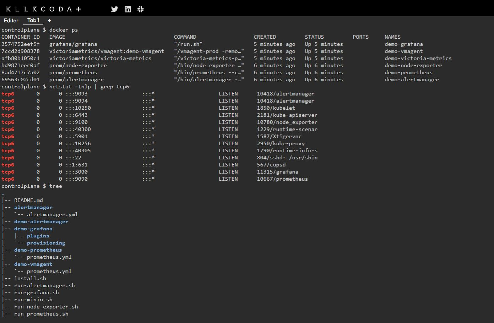
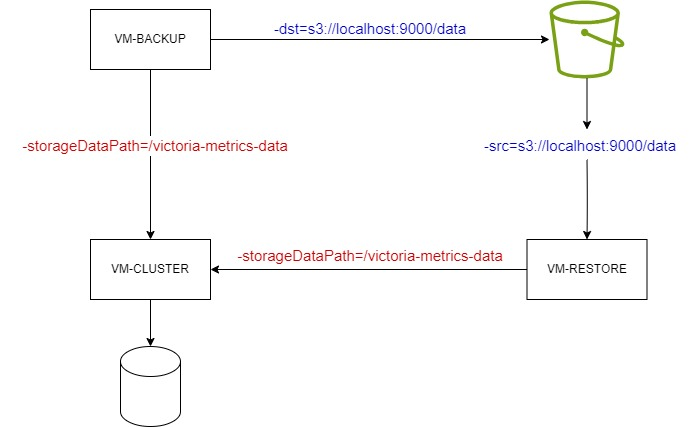

# Setting up Monitoring Stack in a Node (docker container)



### AlertManager Setup | run-alertmanager.sh

```bash
#! /bin/bash

name=$1
default_value="demo"
name=${name:-$default_value}
mkdir -p alertmanager
cat <<EOF >${PWD}/alertmanager/alertmanager.yml
route:
  group_by: ['alertname']
  group_wait: 30s
  group_interval: 5m
  repeat_interval: 1h
  receiver: 'web.hook'
receivers:
  - name: 'web.hook'
    webhook_configs:
      - url: 'http://127.0.0.1:5001/'
inhibit_rules:
  - source_match:
      severity: 'critical'
    target_match:
      severity: 'warning'
    equal: ['alertname', 'dev', 'instance']
EOF

alertmanager_name=${name}-alertmanager
alertmanager_host_port=9093
mkdir -p ${alertmanager_name}

docker rm ${alertmanager_name} -f
docker run -d --restart unless-stopped --network host \
    -v ${PWD}/alertmanager:/etc/alertmanager \
    --name=${alertmanager_name} \
    prom/alertmanager

docker ps -l

```

### Grafana setup | run-grafana.sh

```bash
#! /bin/bash

name=$1
default_value="demo"
name=${name:-$default_value}

#scanner-grafana
grafana_name=${name}-grafana
grafana_host_port=3000
docker rm ${grafana_name} -f
docker run -d --restart unless-stopped --network host \
    --name=${grafana_name} \
    -v ${PWD}/${grafana_name}/plugins:/var/grafana/plugins \
    -v ${PWD}/${grafana_name}/provisioning:/etc/grafana/provisioning \
    grafana/grafana

docker ps -l
```

### node-exporter setup | run-node-exporter.sh

```bash
#! /bin/bash
text_collector_dir=/var/lib/node-exporter/textfile_collector
mkdir -p ${text_collector_dir}

cat <<EOF >/etc/cron.d/directory_size
*/5 * * * * root du -sb /var/log /var/cache/apt /var/lib/prometheus | sed -ne 's/^\([0-9]\+\)\t\(.*\)$/node_directory_size_bytes{directory="\2"} \1/p' > ${text_collector_dir}/directory_size.prom.$$ && mv ${text_collector_dir}/directory_size.prom.$$ ${text_collector_dir}/directory_size.prom
EOF
name=$1
default_value="demo"
name=${name:-$default_value}
node_exporter_name=${name}-node-exporter
node_exporter_host_port=9100

docker rm ${node_exporter_name} -f
docker run -d --restart unless-stopped --network host \
    -v ${text_collector_dir}:${text_collector_dir} \
    --name=${node_exporter_name} \
    prom/node-exporter --collector.textfile.directory=${text_collector_dir}

docker ps -l


```

### Prometheus setup | run-prometheus.sh

```bash
#! /bin/bash
name=$1
default_value="demo"
name=${name:-$default_value}
prometheus_name=${name}-prometheus
mkdir -p ${PWD}/$prometheus_name
cat <<EOF >${PWD}/$prometheus_name/prometheus.yml
global:
  scrape_interval: 15s
  scrape_timeout: 10s
  evaluation_interval: 15s
scrape_configs:
  - job_name: prometheus
    metrics_path: /metrics
    scheme: http
    static_configs:
      - targets:
          - localhost:9090
  - job_name: node-exporter
    metrics_path: /metrics
    scheme: http
    static_configs:
      - targets:
          - localhost:9100
EOF

prometheus_host_port=9090
docker volume create prometheus-data
mkdir -p ${prometheus_name}
docker rm ${prometheus_name} -f
docker run -d --restart unless-stopped --network host \
  --name=${prometheus_name} \
  -v ${PWD}/$prometheus_name/:/etc/prometheus/ \
  -v prometheus-data:/prometheus \
  prom/prometheus
docker ps -l

```

### Install vmagent | run-vmagent.sh

```bash
#! /bin/bash
name=$1
default_value="demo"
name=${name:-$default_value}
vmagent_name=${name}-vmagent
mkdir -p ${PWD}/$vmagent_name

remoteWrite_url="http://localhost:8428/api/v1/write"
cat <<EOF >${PWD}/$vmagent_name/Dockerfile
FROM victoriametrics/vmagent
ENTRYPOINT ["/vmagent-prod"]
CMD ["-remoteWrite.url=$remoteWrite_url" , "-remoteWrite.forceVMProto","-promscrape.config=/etc/prometheus/prometheus.yml"]
EOF

docker build -t victoriametrics/vmagent:$vmagent_name ${PWD}/$vmagent_name/
rm -rf ${PWD}/$vmagent_name/Dockerfile

cat <<EOF >${PWD}/$vmagent_name/prometheus.yml
scrape_configs:
  - job_name: prometheus
    metrics_path: /federate
    scheme: http
    static_configs:
      - targets:
          - localhost:9090
EOF

docker volume create vmagentdata
docker rm ${vmagent_name} -f

docker run -d --restart unless-stopped --network host \
  --name=${vmagent_name} \
  -v ${PWD}/$vmagent_name:/etc/prometheus/ \
  -v vmagentdata:/vmagentdata \
  victoriametrics/vmagent:$vmagent_name

docker ps -l

```

### Install victoria-metrics | run-victoria-metrics.sh

```bash
#! /bin/bash

name=$1
default_value="demo"
name=${name:-$default_value}
docker volume create victoria-metrics-data
# victoria-metrics
victoria_metrics_name=${name}-victoria-metrics
victoria_metrics_host_port=8428
docker rm ${victoria_metrics_name} -f
docker run -d --restart unless-stopped --network host \
    --name=${victoria_metrics_name} \
    -v victoria-metrics-data:/victoria-metrics-data \
    victoriametrics/victoria-metrics

docker ps -l


```

### Install the moitoring stack | install.sh

```bash

name=$1
default_value="demo"
name=${name:-$default_value}

echo run-alertmanager.sh $name
source run-alertmanager.sh $name 1>/dev/null
echo "---"

echo run-prometheus.sh $name
source run-prometheus.sh $name 1>/dev/null
echo "---"

echo run-node-exporter.sh $name
source run-node-exporter.sh $name 1>/dev/null
echo "---"

echo run-victoria-metrics.sh $name
source run-victoria-metrics.sh $name 1>/dev/null
echo "---"

echo run-vmagent.sh $name
source run-vmagent.sh $name 1>/dev/null
echo "---"

echo run-grafana.sh $name
source run-grafana.sh $name 1>/dev/null
echo "---"

docker ps | grep -E "STATUS|$name"

```

### Uninstall the moitoring stack | uninstall.sh

```
#! /bin/bash
name=$1
default_value="demo"
name=${name:-$default_value}

docker ps | grep $name | awk '{print $1}' | xargs docker rm -f

```



### Test the vmbackup and vmrestore



### Run minio for local:S3 | run-minio.sh

```bash
#! /bin/bash

name=$1
default_value="demo"
name=${name:-$default_value}
docker volume create minio-data

# minio
minio_name=${name}-minio
minio_host_port=9000,9001
docker rm ${minio_name} -f
docker run -d --restart unless-stopped --network host \
    --name=${minio_name} \
    -v minio-data:/data \
    -e "MINIO_ROOT_USER=ROOTNAME" \
    -e "MINIO_ROOT_PASSWORD=CHANGEME123" \
    quay.io/minio/minio server /data --console-address ":9001"

docker ps -l
```

### Install the mc client for creating the bucket

```bash
docker run --privileged -v ${PWD}:/tmp -it --network host --entrypoint=/bin/sh minio/mc

S3_ALIAS=demo
S3_ENDPOINT=http://localhost:9000
ACCESS_KEY=ROOTNAME
SECRET_KEY=CHANGEME123
BUCKET_NAME=data
mc alias set $S3_ALIAS $S3_ENDPOINT $ACCESS_KEY $SECRET_KEY --api "s3v4" --path "auto"

mc --insecure rm -r --force $S3_ALIAS/$BUCKET_NAME
mc --insecure mb $BUCKET_NAME

#ref: https://github.com/minio/minio/issues/4769#issuecomment-320319655

```

### Backup

```bash
#!/bin/bash
cat <<EOF >/etc/credentials
[default]
aws_access_key_id=ROOTNAME
aws_secret_access_key=CHANGEME123
EOF

docker run -v victoria-metrics-data:/victoria-metrics-data --network host victoriametrics/vmbackup -storageDataPath=/victoria-metrics-data -snapshot.createURL=http://localhost:8428/snapshot/create -dst=s3://localhost:9000/data -credsFilePath=/etc/credentials -customS3Endpoint=http://localhost:9000


```

### Restore

```bash
cat<<EOF>/etc/credentials
[default]
aws_access_key_id=ROOTNAME
aws_secret_access_key=CHANGEME123
EOF

docker run  -v victoria-metrics-data:/victoria-metrics-data --network host victoriametrics/vmrestore -storageDataPath=/victoria-metrics-data -snapshot.createURL=http://localhost:8428/snapshot/create    -src=s3://localhost:9000/data -credsFilePath=/etc/credentials -customS3Endpoint=http://localhost:9000

```

### Ref:

- [Demo Environment](https://killercoda.com/killer-shell-cks/scenario/container-namespaces-docker)
- [monitoring-stack.git](https://github.com/naren4b/monitoring-stack.git)
